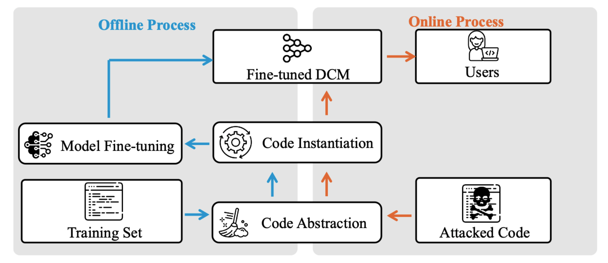

# UNICODE
This repository provides the official implementation of the paper [Paper Title] (published in [Venue]). We organize the code as follows:

📂 Code Structure

CODA/, ALERT/, CodeTAE/, CodeDenoise/

Implementation of each baseline method, with separate modules for different models and tasks.

code/

Our abstraction and instantiation implementations.

🗃 Data & Model Weights

Due to the large volume of experimental data and model files:

Currently, we provide only the CodeDenoise dataset for the code cloning task to support reproducibility.
Model weights are temporarily excluded due to file size constraints.
All datasets and pre-trained weights will be released via [cloud storage (e.g., Google Drive)] after the double-blind review process.



To use our abstract and instantiate methods, you can run the following commands:You just need to replace the input and output paths in the code and replace the api_key of the larger model.
```shell
cd code;
python abstract.py
python normalization.py
```
